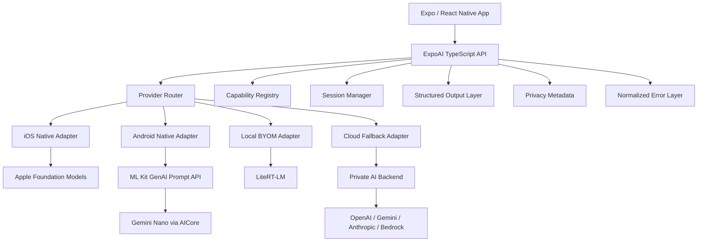

# Expo AI Runtime

## Compact Implementation Architecture

## 1. Product Definition

Expo AI Runtime is a mobile-native AI provider layer for Expo and React Native.

It gives app developers one TypeScript API for:

* Apple Foundation Models
* Android Gemini Nano through AICore / ML Kit GenAI
* Local bring-your-own-model runtimes such as LiteRT-LM
* Optional cloud model fallback
* Streaming
* Sessions
* Structured output
* Capability detection
* Privacy-aware provider routing

This should not start as a full agent framework. The first version should solve the hardest mobile-native problem: safely calling the best available native or local model from a React Native app.

---

## 2. Positioning

### Short positioning

A mobile-native AI runtime for Expo and React Native.

### Expanded positioning

Expo AI Runtime unifies system on-device models, local custom models, and cloud AI providers behind one TypeScript API, with native capability detection and privacy-aware fallback routing.

### What it is not in v1

* Not a full LangChain replacement
* Not a full agent framework
* Not a vector database
* Not a hosted AI backend
* Not a model marketplace at launch

### What it may become

A React Native-native equivalent to parts of LangChain, Vercel AI SDK, and Genkit, but focused on:

* iOS Foundation Models
* Android AICore / Gemini Nano
* Local model execution
* Mobile device capability detection
* Offline-first AI behavior
* App privacy boundaries

---

## 3. Core Architecture



---

## 4. Package Structure

Use a plugin-oriented architecture so the core stays small.

```txt
packages/
  expo-ai-core/
    src/
      index.ts
      ExpoAI.ts
      types.ts
      errors.ts
      provider-router.ts
      capability-registry.ts
      session-manager.ts
      structured-output.ts
      privacy.ts

  expo-ai-apple-foundation-models/
    ios/
      ExpoAIAppleModule.swift
      AppleFoundationModelsAdapter.swift
      AppleSessionStore.swift
      AppleErrorMapper.swift
    src/
      index.ts

  expo-ai-android-aicore/
    android/
      src/main/java/expo/modules/ai/aicore/
        ExpoAICoreModule.kt
        AICoreGeminiNanoAdapter.kt
        AndroidSessionStore.kt
        AndroidErrorMapper.kt
    src/
      index.ts

  expo-ai-litert-lm/
    ios/
    android/
    src/
      index.ts
      model-manager.ts

  expo-ai-cloud/
    src/
      index.ts
      cloud-provider.ts

  expo-ai-evals/
    src/
      eval-runner.ts
      fixtures/
```

For an MVP, this can begin as a monorepo with only:

```txt
expo-ai-core
expo-ai-apple-foundation-models
expo-ai-android-aicore
expo-ai-cloud
```

Defer `expo-ai-litert-lm` until after the system-model bridge works.

---

## 5. Provider Model

```ts
export type ExpoAIProvider =
  | "system-preferred"
  | "apple-foundation-models"
  | "apple-private-cloud-compute"
  | "android-aicore-gemini-nano"
  | "litert-lm"
  | "cloud"
  | "none";
```

Default provider priority:

```ts
export const defaultProviderPriority: ExpoAIProvider[] = [
  "apple-foundation-models",
  "apple-private-cloud-compute",
  "android-aicore-gemini-nano",
  "litert-lm",
  "cloud",
];
```

Provider categories:

| Category      | Provider                     | Purpose                                  |
| ------------- | ---------------------------- | ---------------------------------------- |
| System model  | Apple Foundation Models      | Preferred iOS native model path          |
| System model  | Android AICore / Gemini Nano | Preferred Android native model path      |
| Private cloud | Apple Private Cloud Compute  | Apple-managed larger model path          |
| Local BYOM    | LiteRT-LM                    | Downloaded or bundled local models       |
| Cloud         | Private backend              | Reliable fallback and advanced reasoning |

---

## 6. Public TypeScript API

The public API should be simple and capability-first.

```ts
import { ExpoAI } from "@expo-ai/core";

const result = await ExpoAI.generate({
  prompt: "Summarize this note in five bullets.",
  fallback: "cloud",
});

console.log(result.text);
```

### Core API

```ts
export namespace ExpoAI {
  export function getAvailability(): Promise<ExpoAIAvailability>;

  export function getCapabilities(): Promise<ExpoAICapabilities>;

  export function listProviders(): Promise<ExpoAIProviderInfo[]>;

  export function generate(
    options: GenerateOptions
  ): Promise<GenerateResult>;

  export function stream(
    options: GenerateOptions
  ): AsyncIterable<GenerateChunk>;

  export function createSession(
    options?: CreateSessionOptions
  ): Promise<ExpoAISession>;

  export function generateObject<T>(
    options: GenerateObjectOptions
  ): Promise<T>;

  export function summarize(
    options: SummarizeOptions
  ): Promise<GenerateResult>;

  export function rewrite(
    options: RewriteOptions
  ): Promise<GenerateResult>;

  export function proofread(
    options: ProofreadOptions
  ): Promise<GenerateResult>;
}
```

---

## 7. Capability Detection

Every app-facing feature should check capabilities at runtime.

```ts
export type ExpoAICapabilities = {
  available: boolean;
  provider: ExpoAIProvider;

  isOnDevice: boolean;
  isSystemManagedModel: boolean;
  sendsPromptOffDevice: boolean;

  supportsTextGeneration: boolean;
  supportsStreaming: boolean;
  supportsSessions: boolean;
  supportsStructuredOutput: boolean;
  supportsTools: boolean;
  supportsImageInput: boolean;
  supportsSpeechInput: boolean;

  supportsSummarization: boolean;
  supportsRewrite: boolean;
  supportsProofreading: boolean;

  supportsBringYourOwnModel: boolean;
  supportsModelDownload: boolean;

  contextWindow?: number;

  reasonUnavailable?: ExpoAIUnavailableReason;
};
```

Unavailable reasons:

```ts
export type ExpoAIUnavailableReason =
  | "unsupported_os_version"
  | "unsupported_device"
  | "model_not_downloaded"
  | "model_initializing"
  | "apple_intelligence_disabled"
  | "aicore_unavailable"
  | "aicore_initializing"
  | "unsupported_bootloader_state"
  | "missing_dependency"
  | "provider_not_configured"
  | "unknown";
```

---

## 8. Session Model

The Expo layer owns the cross-platform session abstraction.

```ts
export type CreateSessionOptions = {
  instructions?: string;
  provider?: ExpoAIProvider;
  fallback?: "none" | "cloud" | "any";
  temperature?: number;
  maxOutputTokens?: number;
  metadata?: Record<string, string>;
};
```

```ts
export type ExpoAISession = {
  id: string;
  provider: ExpoAIProvider;

  generate(options: SessionGenerateOptions): Promise<GenerateResult>;

  stream(options: SessionGenerateOptions): AsyncIterable<GenerateChunk>;

  generateObject<T>(
    options: SessionGenerateObjectOptions
  ): Promise<T>;

  reset(): Promise<void>;

  dispose(): Promise<void>;
};
```

Native mapping:

| Concept           | iOS                              | Android                    | Cloud               |
| ----------------- | -------------------------------- | -------------------------- | ------------------- |
| Session           | Native Foundation Models session | Native or emulated session | Conversation/thread |
| Instructions      | Native instructions              | Prompt prefix              | System message      |
| Streaming         | Native if available              | Native or emulated         | Provider stream     |
| Structured output | Native if available              | JSON prompt + validation   | JSON mode/tools     |
| Tools             | Native if available              | Emulated                   | Provider tools      |

---

## 9. Native Module Boundary

Keep native methods primitive. Put ergonomics in TypeScript.

```ts
NativeExpoAI.getAvailability(): Promise<NativeAvailability>;

NativeExpoAI.getCapabilities(): Promise<NativeCapabilities>;

NativeExpoAI.generate(
  options: NativeGenerateOptions
): Promise<NativeGenerateResult>;

NativeExpoAI.createSession(
  options: NativeCreateSessionOptions
): Promise<{ sessionId: string; provider: ExpoAIProvider }>;

NativeExpoAI.generateInSession(
  sessionId: string,
  options: NativeGenerateOptions
): Promise<NativeGenerateResult>;

NativeExpoAI.disposeSession(
  sessionId: string
): Promise<void>;
```

Streaming should use native events:

```ts
NativeExpoAI.startStreaming(
  requestId: string,
  options: NativeGenerateOptions
): Promise<void>;

NativeExpoAI.cancelStreaming(
  requestId: string
): Promise<void>;
```

Event shape:

```ts
export type ExpoAIStreamEvent =
  | { requestId: string; type: "start" }
  | { requestId: string; type: "token"; text: string }
  | { requestId: string; type: "error"; error: ExpoAIError }
  | { requestId: string; type: "done"; result: GenerateResult };
```

---

## 10. iOS Adapter

Primary native provider:

```txt
Apple Foundation Models
```

Responsibilities:

* Check OS and model availability.
* Detect Apple Intelligence disabled or unavailable states.
* Create and store native sessions.
* Support generation.
* Support streaming where available.
* Support structured output where available.
* Map native errors into `ExpoAIError`.
* Return privacy metadata.

Implementation files:

```txt
ios/
  ExpoAIAppleModule.swift
  AppleFoundationModelsAdapter.swift
  AppleSessionStore.swift
  AppleErrorMapper.swift
```

Pseudo-shape:

```swift
public class ExpoAIAppleModule: Module {
  public func definition() -> ModuleDefinition {
    Name("ExpoAIApple")

    AsyncFunction("getAvailability") { () async throws in
      return try await AppleFoundationModelsAdapter.getAvailability()
    }

    AsyncFunction("generate") { (options: [String: Any]) async throws in
      return try await AppleFoundationModelsAdapter.generate(options)
    }
  }
}
```

---

## 11. Android Adapter

Primary native provider:

```txt
ML Kit GenAI Prompt API
Gemini Nano
AICore
```

Responsibilities:

* Check AICore readiness.
* Detect unsupported devices.
* Detect initializing / model unavailable states.
* Create or emulate sessions.
* Support prompt-based generation.
* Support task helpers such as summarize/rewrite/proofread where available.
* Map native errors into `ExpoAIError`.
* Return privacy metadata.

Implementation files:

```txt
android/
  src/main/java/expo/modules/ai/aicore/
    ExpoAICoreModule.kt
    AICoreGeminiNanoAdapter.kt
    AndroidSessionStore.kt
    AndroidErrorMapper.kt
```

Pseudo-shape:

```kotlin
class ExpoAICoreModule : Module() {
  override fun definition() = ModuleDefinition {
    Name("ExpoAICore")

    AsyncFunction("getAvailability") {
      AICoreGeminiNanoAdapter.getAvailability(appContext.reactContext)
    }

    AsyncFunction("generate") { options: Map<String, Any?> ->
      AICoreGeminiNanoAdapter.generate(appContext.reactContext, options)
    }
  }
}
```

Android should never assume AICore is ready. It should return a retryable unavailable state when the model or service is still initializing.

---

## 12. LiteRT-LM Adapter

LiteRT-LM should be the preferred bring-your-own-model runtime, but not part of the first MVP unless the system provider bridge is already stable.

Responsibilities:

* Manage model files.
* Verify model compatibility.
* Handle downloads and checksums.
* Initialize runtime.
* Run inference.
* Surface memory and performance errors.
* Support provider metadata.

Model config:

```ts
export type LocalModelConfig = {
  id: string;
  runtime: "litert-lm";
  source: "bundled" | "remote" | "huggingface" | "file";
  uri?: string;
  checksum?: string;
  sizeBytes?: number;
  license?: string;
};
```

Usage:

```ts
await ExpoAI.generate({
  provider: "litert-lm",
  model: {
    id: "google/gemma-mobile",
    runtime: "litert-lm",
    source: "huggingface",
  },
  prompt: "Summarize this document.",
});
```

---

## 13. Cloud Fallback

Cloud fallback should exist in v1 as an adapter interface, even if the implementation starts as a private backend stub.

```ts
export type CloudProviderConfig = {
  endpoint: string;
  headers?: Record<string, string>;
  provider?: "openai" | "gemini" | "anthropic" | "bedrock" | "custom";
};
```

Fallback behavior:

```ts
await ExpoAI.generate({
  prompt: "Extract the risks from this proposal.",
  fallback: "cloud",
});
```

Routing rules:

1. Try the requested provider.
2. If unavailable and fallback is allowed, try the next provider.
3. If prompt is sensitive and cloud fallback is disabled, fail locally.
4. Return provider metadata with every result.

---

## 14. Privacy Model

Every result should identify where processing happened.

```ts
export type ExpoAIPrivacyInfo = {
  provider: ExpoAIProvider;
  isOnDevice: boolean;
  sendsPromptOffDevice: boolean;
  privacyMode:
    | "on-device"
    | "apple-private-cloud-compute"
    | "third-party-cloud"
    | "unknown";
};
```

Recommended UI copy:

| Mode                        | Copy                                            |
| --------------------------- | ----------------------------------------------- |
| On-device                   | Processed privately on this device.             |
| Apple Private Cloud Compute | Processed using Apple Private Cloud Compute.    |
| Third-party cloud           | Processed using a configured cloud AI provider. |

Do not silently fall back to third-party cloud for sensitive workflows unless the app has disclosed and enabled this behavior.

---

## 15. Structured Output

Expose structured output from the start.

```ts
const result = await ExpoAI.generateObject({
  prompt: "Extract project name, budget, timeline, and risks.",
  schema: {
    type: "object",
    properties: {
      projectName: { type: "string" },
      budget: { type: "string" },
      timeline: { type: "string" },
      risks: {
        type: "array",
        items: { type: "string" },
      },
    },
    required: ["projectName", "timeline", "risks"],
  },
  fallback: "cloud",
});
```

Implementation strategy:

| Provider                | Strategy                                           |
| ----------------------- | -------------------------------------------------- |
| Apple Foundation Models | Native guided generation where available           |
| Android AICore          | JSON prompt + validation + repair retry            |
| LiteRT-LM               | JSON prompt + validation + repair retry            |
| Cloud                   | Provider-native JSON mode or tools where available |

---

## 16. Error Model

Normalize all provider errors.

```ts
export class ExpoAIError extends Error {
  code: ExpoAIErrorCode;
  provider: ExpoAIProvider;
  retryable: boolean;
  fallbackRecommended: boolean;
  nativeMessage?: string;
}
```

```ts
export type ExpoAIErrorCode =
  | "UNAVAILABLE"
  | "UNSUPPORTED_DEVICE"
  | "MODEL_NOT_READY"
  | "MODEL_DOWNLOAD_REQUIRED"
  | "USER_SETTING_REQUIRED"
  | "INVALID_PROMPT"
  | "CONTEXT_WINDOW_EXCEEDED"
  | "SAFETY_BLOCKED"
  | "RATE_LIMITED"
  | "CANCELLED"
  | "TIMEOUT"
  | "NATIVE_PROVIDER_ERROR"
  | "UNKNOWN";
```

---

## 17. Evaluation Harness

Add an eval package early, even if it is simple.

Purpose:

* Compare provider output quality.
* Verify schema validity.
* Track latency.
* Track fallback frequency.
* Test privacy boundaries.
* Detect SDK regressions.

Structure:

```txt
expo-ai-evals/
  fixtures/
    summarize.json
    rewrite.json
    extract.json
    safety.json
  src/
    runEvalSuite.ts
    scoreSchemaValidity.ts
    compareProviders.ts
```

Eval result:

```ts
export type EvalResult = {
  provider: ExpoAIProvider;
  testName: string;
  passed: boolean;
  latencyMs: number;
  usedFallback: boolean;
  schemaValid?: boolean;
  errorCode?: ExpoAIErrorCode;
};
```

---

## 18. MVP Scope

Build first:

```txt
@expo-ai/core
@expo-ai/apple-foundation-models
@expo-ai/android-aicore
@expo-ai/cloud
```

MVP API:

```ts
ExpoAI.getAvailability()
ExpoAI.getCapabilities()
ExpoAI.listProviders()
ExpoAI.generate()
ExpoAI.createSession()
ExpoAI.generateObject()
ExpoAI.summarize()
ExpoAI.rewrite()
```

MVP features:

* iOS system model provider
* Android system model provider
* Cloud fallback adapter
* Capability detection
* Normalized errors
* Privacy metadata
* Basic structured output
* Basic streaming if native support is available

Defer:

* LiteRT-LM
* model catalog
* model downloads
* local RAG
* native tools
* agent loop
* long-term memory
* Genkit/LangChain bridges

---

## 19. Phase Roadmap

### Phase 1: System Provider MVP

Deliver:

* Core TypeScript API
* iOS Foundation Models adapter
* Android AICore / ML Kit adapter
* Capability detection
* Generate
* Session creation
* Error normalization
* Privacy metadata

### Phase 2: Cloud Fallback + Structured Output

Deliver:

* Private backend cloud adapter
* Provider routing
* `generateObject`
* JSON validation and repair loop
* Provider metadata on every result

### Phase 3: Streaming

Deliver:

* Native event streaming
* AsyncIterable wrapper
* Cancellation
* Timeout handling

### Phase 4: Task APIs

Deliver:

* summarize
* rewrite
* proofread
* image input where available
* provider-specific feature mapping

### Phase 5: LiteRT-LM BYOM

Deliver:

* LiteRT-LM provider
* model file manager
* remote model download
* checksum verification
* model compatibility metadata

### Phase 6: Local Context / RAG

Deliver:

* local search abstraction
* app-managed local index
* `generateWithContext`
* future platform-specific search adapters

### Phase 7: Tools + Agent Loop

Deliver:

* tool registry
* native iOS tool support where available
* JS-emulated Android tools
* tool-call validation
* loop limits
* permissions

### Phase 8: Backend Framework Bridges

Deliver optional integrations:

* Genkit backend bridge
* LangChain backend bridge
* Vercel AI SDK backend bridge

---

## 20. Key Engineering Principles

1. Capabilities over assumptions
   Every feature should be runtime-detected.

2. Providers over platforms
   iOS and Android can each support multiple providers.

3. Stable TypeScript API, replaceable native adapters
   Native SDKs will change faster than the public API.

4. Privacy metadata on every result
   The app should always know whether inference happened on-device or off-device.

5. Cloud fallback must be explicit
   Never silently send sensitive prompts to third-party cloud providers.

6. Start with generation, not agents
   Agents, tools, RAG, and memory should come after the provider layer is reliable.

7. BYOM is separate from system models
   Apple Foundation Models and Android AICore are system-model providers. LiteRT-LM is the first BYOM path.

---

## 21. First Build Checklist

### Repository

* Create monorepo.
* Add package workspaces.
* Add example Expo app.
* Add TypeScript build.
* Add native iOS module.
* Add native Android module.

### Core API

* Define provider types.
* Define capability types.
* Define error types.
* Implement provider router.
* Implement cloud fallback interface.
* Implement structured output validator.

### iOS

* Add Expo module.
* Add availability check.
* Add generate method.
* Add session store.
* Map native errors.

### Android

* Add Expo module.
* Add ML Kit / AICore dependency.
* Add availability check.
* Add generate method.
* Add retryable AICore initialization state.
* Map native errors.

### Example App

* Show capability card.
* Show generate prompt box.
* Show provider used.
* Show privacy mode.
* Show fallback state.
* Show error details.

### Tests

* Unit test provider routing.
* Unit test error mapping.
* Unit test schema validation.
* Add basic device integration tests.
* Add golden prompt fixtures.

---

## 22. Recommended v1 Name

Package naming options:

```txt
@expo-ai/core
@expo-ai/runtime
@stewmore/expo-ai-runtime
expo-ai-runtime
expo-local-ai
```

Best working name:

```txt
expo-ai-runtime
```

Why:

* Broader than “foundation models”
* Does not imply Apple-only behavior
* Allows cloud, local, and system providers
* Leaves room for future agent/runtime features

---

## 23. Summary

Build this as a mobile-native AI runtime, not a full agent framework.

The first milestone should prove:

* iOS can call Apple Foundation Models through Expo.
* Android can call Gemini Nano through AICore / ML Kit through Expo.
* The same TypeScript API works across both.
* Apps can detect capabilities before showing features.
* Results include provider and privacy metadata.
* Cloud fallback is explicit and controllable.
* Structured output works consistently enough for app features.

Once that foundation is stable, expand into LiteRT-LM, model downloads, local context, tools, and backend framework bridges.
