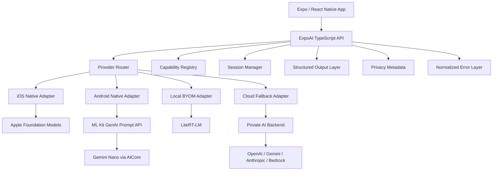

# Architecture

The `ExpoAI` TypeScript API sits in front of a small set of pure-TS subsystems — the
provider router, capability registry, session manager, structured-output layer, privacy
metadata, and a normalized error layer — which in turn drive platform adapters.



## Package structure

A plugin-oriented architecture keeps the core small. Provider packages register their
adapter against the core registry at import time; the core never depends on a native
module directly.

```txt
packages/
  expo-ai-core/                      # ExpoAI API, router, registry, sessions, schema, privacy, errors
  expo-ai-apple-foundation-models/   # iOS adapter (Swift, FoundationModels)
  expo-ai-android-aicore/            # Android adapter (Kotlin, ML Kit GenAI)
  expo-ai-cloud/                     # cloud fallback client adapter
  expo-ai-evals/                     # Node eval harness
```

## Design principles

1. **Capabilities over assumptions** — every feature is runtime-detected.
2. **Providers over platforms** — iOS and Android can each support multiple providers.
3. **Stable TypeScript API, replaceable native adapters** — native SDKs change faster
   than the public API.
4. **Privacy metadata on every result** — the app always knows whether inference
   happened on- or off-device.
5. **Cloud fallback must be explicit** — never silently send sensitive prompts to
   third-party cloud providers.
6. **Start with generation, not agents** — agents, tools, RAG, and memory come after the
   provider layer is reliable.
7. **BYOM is separate from system models** — Apple Foundation Models and Android AICore
   are system-model providers; LiteRT-LM is the first bring-your-own-model path.
